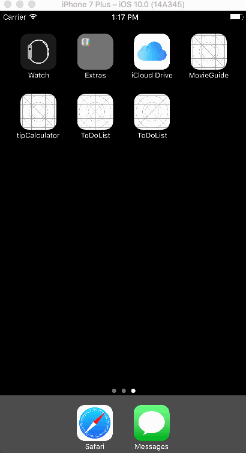

#**Tip Calculator** is a tip calculator application for iOS.

By: **Jason Wong**

This is an iOS prework application written in Swift 3 for Codepath University.

##Implementation:

* [x] User can enter a bill amount, choose a tip percentage, and see the tip and total values.
* [x] Settings page to change the default tip percentage.

##Demo:

